# Тестовое задание python-developer. ООО "Виста"

## База данных

Схема бд (визуализирована с помощью MySQL Workbench):

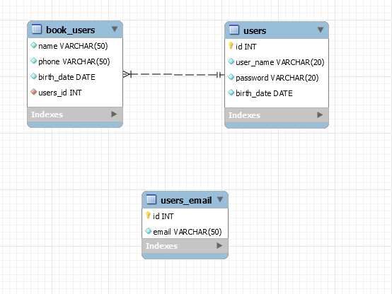

Дамп базы данных - dump.sql


## Инструкция по разворачиванию приложения

1) Восстанавливаем базу данных с помощью дампа (dump.sql)
2) Устанавливаем все необходимые пакеты ```pip install -r requirements.txt```
4) В файле databaseUtil/database_requests.py необходимо выставить свои данные по бд (6-10 строчка)
3) Запуск приложения осуществляется с помощью команды ```python main.py```

*Инструкция для разворачивания приложения на операционной системе Windows*

## Руководство пользователя по приложению

После запуска программы, перед пользователем появляется окно авторизации.

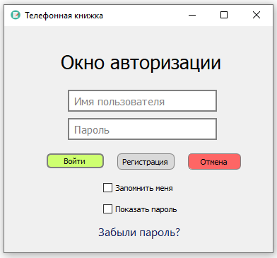

Пользователь вводит логин и пароль, нажимает кнопку «Войти». В случае отсутствия пользователя с такими данными в БД, появляется всплывающее окно «Вы ввели неверный логин или пароль».

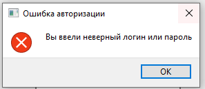

Если пользователь забыл пароль – по нажатию на ссылку «Забыли пароль?» открывается окно «Восстановление пароля»

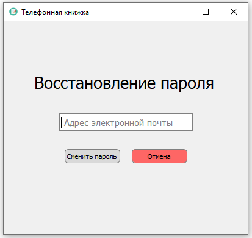

Если введенный email пользователя окажется некорректным, он получит соответствующую ошибку:

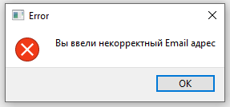

*В ином случаи, запись с email-ом пользователя сохранится в базе данных.*

При нажатии на кнопку «Регистрация» открывается окно «Регистрация»

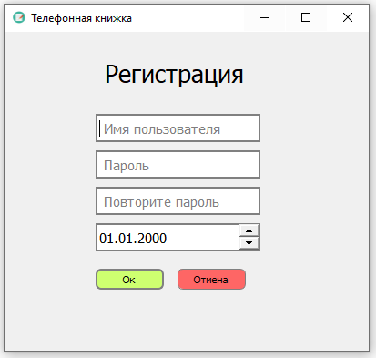

В случае успешного входа/регистрации перед пользователем открывается главное окно с навигацией по Алфавиту, где выведен список именинников на ближайшую неделю.

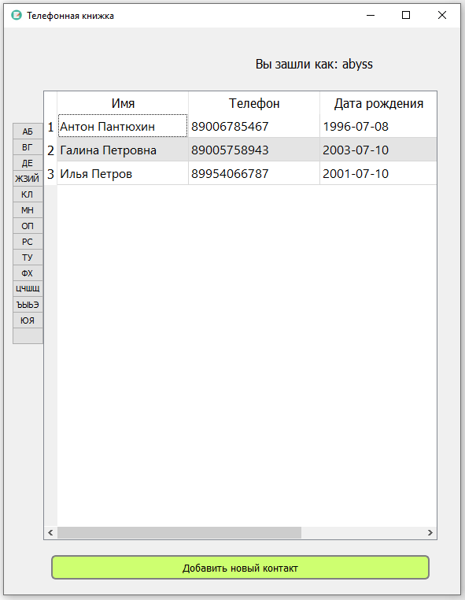

После нажатия по клавише со списком букв, выводится список контактов из этого диапазона букв.

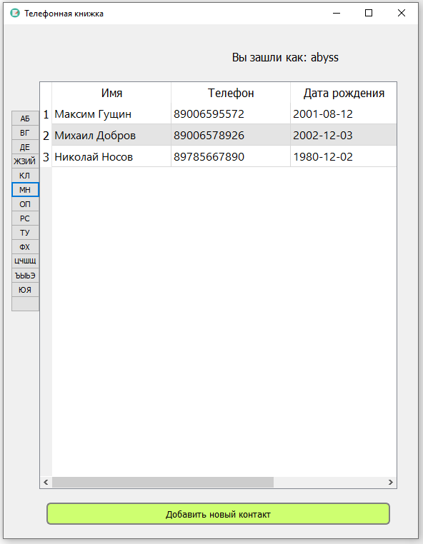

После нажатия по пустой клавише, выводится список всех контактов пользователя.

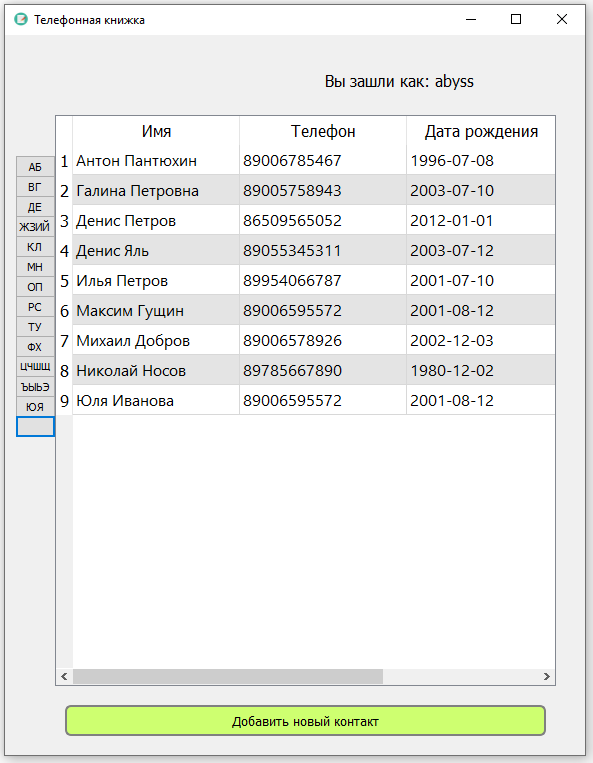

При нажатии на кнопку «Добавить новый контакт» открывается окно добавления нового контакта.

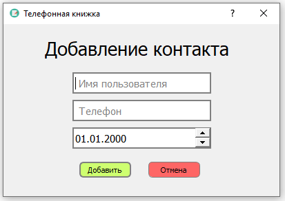

После успешного добавления нового контакта, пользователь получает сообщение об успешном добавлении.
Запись о новом пользователе автоматически добавляется в книжку и переносится на нужную страницу в алфавитном указателе.

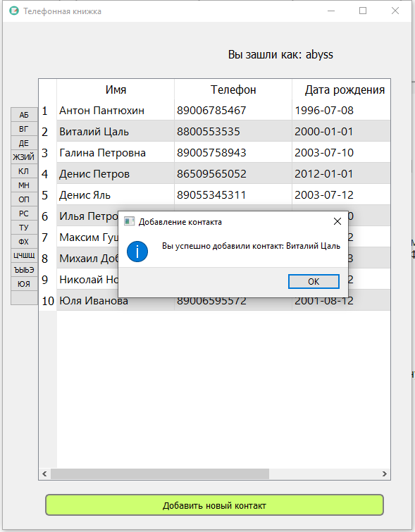
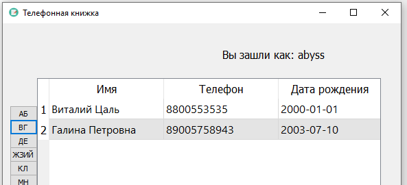

Если добавляемый контакт уже есть в книжке у пользователя, то он получает соответствующую ошибку. 

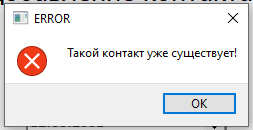

По нажатию любого из полей контакта, появляется окно «Редактирование контакта».

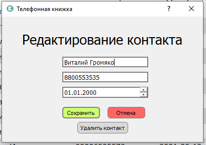

В этом же окне есть возможность удалить выбранный контакт по кнопке «Удалить контакт»:

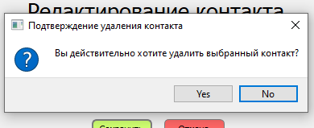

*Аналогично с добавлением, после редактирования или удаления контакта, данные в таблице автоматически обновляются.*

## Стек используемых технологий

1) python3
2) PyQt5
3) Qt Designer
4) СУБД MariaDB
5) OC - Windows